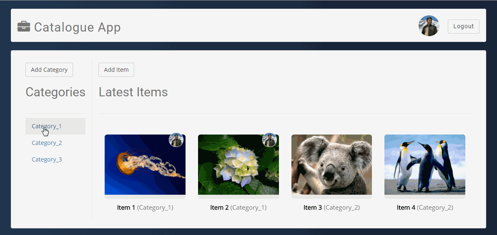

<link href="https://fonts.googleapis.com/css?family=Playball" rel="stylesheet">

<p align=center style="font-family: 'Playball', cursive; font-size: 60px; color: #303f9f">Catalogue Application</p>
<p align="center">
  <a href="https://opensource.org/licenses/MIT" target="_blank">
    
  </a>
  <a href="#" target="_blank">
    
  </a>
  <a href="#" target="_blank">
    
  </a>
</p>

> Catalogue Application is a small full stack project with a backend and web frontend. It's a CRUD (Create, Read, Update, Delete) application. The database backend is built using SQLITE database with object relationship modelling (ORM) done using SQLALCHEMY. The backend is written in python and uses flask web framework, wherein a lightweight python web server is constructed to query the SQL database. Project uses Jinja2 templating engine for Python. Results are then displayed on a bootstrap based frontend. Frontend is written in HTML, CSS and BOOTSTRAP 3.

## Preview



## Features

> It's a CRUD (Create, Read, Update, Delete) application.

> The project uses Google signin for OAuth authentication and authorisation of users.

> Permission for CRUD operators for authenticated users.

> The project also implements JSON endpoints.

> CSRF protection on CREATE and UPDATE operations

> Form validations on CREATE and UPDATE operations

> CRUD operations on item images.

> Logged in user's image is displayed on his created items.

## Getting started

This full stack project can be started using

```
    git clone <repository>
    cd <repository>
```

```python
    pip install -r requirements.txt
    python database_setup.py
    python application.py
```

Database is newly created so its empty, new data needs to be added using catalogue app.

## Tools used

* Frontend: HTML, CSS, Bootstrap 3 web framework
* Backend: Python 3, Flask web development framework
* Database: SQLITE
* Object Relationship Modelling (ORM): Sqlalchemy
* Jinja2 Templates
* OAuth
* Fonts: [Google fonts](https://fonts.google.com/ "Google Fonts")
* Color gradient: [uiGradients](https://uigradients.com/ "uiGradients")

## Project structure

Its a full stack CRUD application with a backend and  web frontend.

### Templates

* `deletecategory.html` : Template for deleting a category

* `deleteitem.html` : Template for deleting an item

* `editcategory.html` : Template for editing a category

* `edititems.html` :  Template for editing an item

* `index.html` : Template for displaying all categories and latest items

* `itemdescription.html` : Template for displaying an item description

* `items.html` : Template all items in a category

* `newCategory.html` : Template for new Category

* `newitem.html` : Template for new item

* `pindex.html` : Template for authenticated index.html

* `pitemdescription.html` : Template for authenticated itemdescription.html

* `pitems.html` :  Template for authenticated items.html

* `login.html` : Template for displaying the login page

### Form validation classes

* New Category form
```python
class NewCategoryForm(FlaskForm): Validates new category form
```

* New Item form
```python
class NewItemForm(FlaskForm): Validates new item form
```

* Edit Category form
```python
class EditCategoryForm(FlaskForm): Validates edit category form
```

* Edit Item form
```python
class EditItemForm(FlaskForm): Validates edit item form
```


### CRUD (CREATE, READ, UPDATE, DELETE) APIs


* CREATE APIs
```python
  def newcategory() : Creates a new Category
```

```python
  def newitem() : Creates a new Item
```

* READ APIs:
```python
  def showallitems(category_name) : show all items in a Category
  ```

```python
  def showaitem(category_name, item_name) : show a Item in a Category
```

```python
  def showcontents() : show all contents i.e. categories and items
```

* UPDATE APIs:
```python
  def editcategory(category_name) : Edit a Category
```
```python
  def edititem(category_name, item_name) : Edit an item
```

* DELETE APIs:
```python
  def deletecategory(category_name) : Deletes a Category
  ```

```python
  def deleteitem(category_name, item_name) : Deletes a item
```

### Login APIs

```python
  def showlogin() : Renders a login page with a unique token
```

```python
  def gconnect() : Authenticates user using google signin features
```

```python
  def gdisconnect() : Revoke a current user's token and reset their login session
```

### JSON Endpoints

```python
  def showenteriesJSON() : Returns JSON of complete catalogue

  Sample JSON output
  {
  "Category": [
    {
      "id": 1,
      "name": "Category_1",
      "items": [
        {
          "cat_id": 1,
          "id": 1,
          "title": "Item 1",
          "description": "Lorem ipsum dolor sit amet, ultrices condimentum neque, in ipsum ipsum odio. Pellentesque cum fusce velit luctus, a vel in doloremque morbi vitae sed, dolor nullam nibh quis lacinia aliquet fermentum. Libero neque sed faucibus sed nam, neque lectus mi, amet ut eget egestas cillum. Aenean porta eu integer malesuada ultrices. A gravida, sit praesent eu lectus per, a quibusdam cras. Rhoncus in. Vestibulum tempor eu accumsan ultrices. Aliquam fermentum semper ligula et dictumst, sit tellus, eu sapien praesent nisl dui pellentesque vestibulum. Montes dictum quam. Eget sit, lectus wisi lorem nisl sollicitudin, ac id donec elit quis etiam, lorem nam, sodales sit ac eget enim in urna."
        },
        {
          "cat_id": 1,
          "id": 2,
          "title": "Item 2",
          "description": "Lorem ipsum dolor sit amet, ultrices condimentum neque, in ipsum ipsum odio. Pellentesque cum fusce velit luctus, a vel in doloremque morbi vitae sed, dolor nullam nibh quis lacinia aliquet fermentum. Libero neque sed faucibus sed nam, neque lectus mi, amet ut eget egestas cillum. Aenean porta eu integer malesuada ultrices. A gravida, sit praesent eu lectus per, a quibusdam cras. Rhoncus in. Vestibulum tempor eu accumsan ultrices. Aliquam fermentum semper ligula et dictumst, sit tellus, eu sapien praesent nisl dui pellentesque vestibulum. Montes dictum quam. Eget sit, lectus wisi lorem nisl sollicitudin, ac id donec elit quis etiam, lorem nam, sodales sit ac eget enim in urna."
        }
      ]
    },
    {
      "id": 2,
      "name": "Category_2",
      "items": [
        {
          "cat_id": 2,
          "id": 3,
          "title": "Item 3",
          "description": "Lorem ipsum dolor sit amet, ultrices condimentum neque, in ipsum ipsum odio. Pellentesque cum fusce velit luctus, a vel in doloremque morbi vitae sed, dolor nullam nibh quis lacinia aliquet fermentum. Libero neque sed faucibus sed nam, neque lectus mi, amet ut eget egestas cillum. Aenean porta eu integer malesuada ultrices. A gravida, sit praesent eu lectus per, a quibusdam cras. Rhoncus in. Vestibulum tempor eu accumsan ultrices. Aliquam fermentum semper ligula et dictumst, sit tellus, eu sapien praesent nisl dui pellentesque vestibulum. Montes dictum quam. Eget sit, lectus wisi lorem nisl sollicitudin, ac id donec elit quis etiam, lorem nam, sodales sit ac eget enim in urna."
        },
        {
          "cat_id": 2,
          "id": 4,
          "title": "Item 4",
          "description": "Lorem ipsum dolor sit amet, ultrices condimentum neque, in ipsum ipsum odio. Pellentesque cum fusce velit luctus, a vel in doloremque morbi vitae sed, dolor nullam nibh quis lacinia aliquet fermentum. Libero neque sed faucibus sed nam, neque lectus mi, amet ut eget egestas cillum. Aenean porta eu integer malesuada ultrices. A gravida, sit praesent eu lectus per, a quibusdam cras. Rhoncus in. Vestibulum tempor eu accumsan ultrices. Aliquam fermentum semper ligula et dictumst, sit tellus, eu sapien praesent nisl dui pellentesque vestibulum. Montes dictum quam. Eget sit, lectus wisi lorem nisl sollicitudin, ac id donec elit quis etiam, lorem nam, sodales sit ac eget enim in urna."
        }
      ]
    },
    {
      "id": 3,
      "name": "Category_3"
    }
  ]
}
```

```python
  def getitemsJSON(category_name): Returns JSON of items in a Category

  Sample JSON output:
  {
  "Items": [
    {
      "cat_id": 1,
      "id": 1,
      "title": "Item 1",
      "description": "Lorem ipsum dolor sit amet, ultrices condimentum neque, in ipsum ipsum odio. Pellentesque cum fusce velit luctus, a vel in doloremque morbi vitae sed, dolor nullam nibh quis lacinia aliquet fermentum. Libero neque sed faucibus sed nam, neque lectus mi, amet ut eget egestas cillum. Aenean porta eu integer malesuada ultrices. A gravida, sit praesent eu lectus per, a quibusdam cras. Rhoncus in. Vestibulum tempor eu accumsan ultrices. Aliquam fermentum semper ligula et dictumst, sit tellus, eu sapien praesent nisl dui pellentesque vestibulum. Montes dictum quam. Eget sit, lectus wisi lorem nisl sollicitudin, ac id donec elit quis etiam, lorem nam, sodales sit ac eget enim in urna."
    },
    {
      "cat_id": 1,
      "id": 2,
      "title": "Item 2",
      "description": "Lorem ipsum dolor sit amet, ultrices condimentum neque, in ipsum ipsum odio. Pellentesque cum fusce velit luctus, a vel in doloremque morbi vitae sed, dolor nullam nibh quis lacinia aliquet fermentum. Libero neque sed faucibus sed nam, neque lectus mi, amet ut eget egestas cillum. Aenean porta eu integer malesuada ultrices. A gravida, sit praesent eu lectus per, a quibusdam cras. Rhoncus in. Vestibulum tempor eu accumsan ultrices. Aliquam fermentum semper ligula et dictumst, sit tellus, eu sapien praesent nisl dui pellentesque vestibulum. Montes dictum quam. Eget sit, lectus wisi lorem nisl sollicitudin, ac id donec elit quis etiam, lorem nam, sodales sit ac eget enim in urna."
    }
  ]
}
```

```python
  def getAllCategoriesJSON(): Returns JSON of all categories.

  Sample JSON output:
  {
  "Categories": [
    {
      "id": 1,
      "name": "Category_1"
    },
    {
      "id": 2,
      "name": "Category_2"
    },
    {
      "id": 3,
      "name": "Category_3"
    }
  ]
}
```

```python
  def getAItemJSON(category_name, item_name): Returns JSON of an item in a Category

  Sample JSON Output:
  {
  "Item": {
    "cat_id": 1,
    "id": 1,
    "title": "Item 1",
    "description": "Lorem ipsum dolor sit amet, ultrices condimentum neque, in ipsum ipsum odio. Pellentesque cum fusce velit luctus, a vel in doloremque morbi vitae sed, dolor nullam nibh quis lacinia aliquet fermentum. Libero neque sed faucibus sed nam, neque lectus mi, amet ut eget egestas cillum. Aenean porta eu integer malesuada ultrices. A gravida, sit praesent eu lectus per, a quibusdam cras. Rhoncus in. Vestibulum tempor eu accumsan ultrices. Aliquam fermentum semper ligula et dictumst, sit tellus, eu sapien praesent nisl dui pellentesque vestibulum. Montes dictum quam. Eget sit, lectus wisi lorem nisl sollicitudin, ac id donec elit quis etiam, lorem nam, sodales sit ac eget enim in urna."
  }
}
```

## Found issue/Report new feature

Please report it via Issues tab

## License

This project is licensed under [MIT License](license.md)